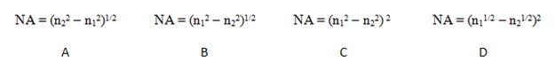
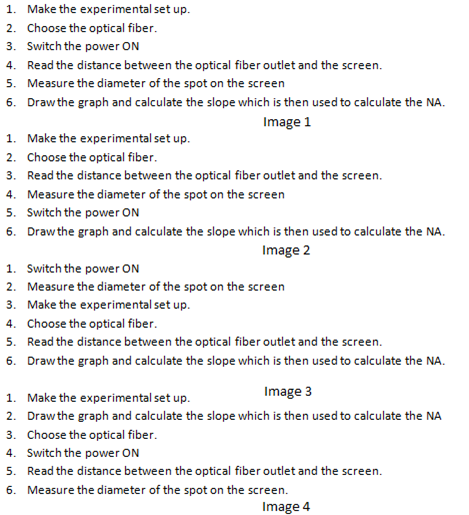

## Pedagogy (Round 1)

 
 
<b> Experiment  Measurement of Numerical Aperture of Optical Fiber    

<b>Discipline | <b>Physical Sciences
:--|:--|
<b> Lab | <b>  Basics of Physics
<b> Experiment|     <b> 1. Measurement of Numerical Aperture of Optical Fiber

<h4> [1. Focus Area](#LO)
<h4> [2. Learning Objectives ](#LO)
<h4> [3. Instructional Strategy](#IS)
<h4> [4. Task & Assessment Questions](#AQ)
<h4> [5. Simulator Interactions](#SI)

#### 1. Focus Area :  Reinforce theoretical concept

#### 2. Learning Objectives and Cognitive Level

Sr. No |	Learning Objective	| Cognitive Level | Action Verb
:--|:--|:--|:-:
1.| Identify the relation between Numerical aperture of the optical fiber and the refractive index of the core and cladding  | Recall  | Identify 
2.|  Describe the methodology to vary the distance between the optical fiber outlet and the screen and to measure the diameter of the spot on the screen. |  Understand | Describe
3.|  Predict the half acceptance angle of the optical fiber by plotting a graph between the distance between the optical fiber outlet and the screen. |  Apply |  Predict
4.| Examine the slope of plotted graph and calculate the value of αmax. | Analyze |  Examine
5.|  Conclude the  value of Numerical aperture of the given optical fiber |  Evaluate |  Conclude

 

    <b><a href="#top">↥ back to top</a></b>

 

#### 3. Instructional Strategy
###### Name of Instructional Strategy  :     Expository
###### Assessment Method: As per handout

<u> <b>Description: </b> of how you are going to implement the above Instructional Strategy in your Simulator: </u>
 
 Brief description as per handout

 

    <b><a href="#top">↥ back to top</a></b>

 

#### 4. Task & Assessment Questions:

Read the theory and comprehend the concepts related to the experiment. [LO1, LO2, LO3]
 

Sr. No |	Learning Objective	| Task to be performed by   the student  in the simulator | Assessment Questions as per LO & Task
:--|:--|:--|:-:
1.|  Student will identify the relation between Numerical aperture of the optical fiber and the refractive index of the core and cladding. |  Student will be given 4 images for the relation between Numerical aperture of the optical fiber and the refractive index of the core and cladding and will choose correct image from them. |  Choose the correct image for Numerical aperture of the optical fiber and the refractive index of the core and cladding is: a) A    b) B  c) C  d) D 
2.| To enable the student to describe the methodology to vary the distance between the optical fiber outlet and the screen and to measure the diameter of the spot on the screen. | Student will be given 4 images for the correct procedure to be followed in the experiment. He will choose correct image from them. | Choose the image which shows the correct order of the procedure to be followed in this experiment:  A. image1   B. image2   C. image3   <b> D. image4 </b>   
3.|  Student will be able to Predict the half acceptance angle of the optical fiber by plotting a graph between the distance between the optical fiber outlet and the screen. |  Student will make experimental setup followed by taking observations for the half acceptance angle of the optical fiber by plotting a graph between the distance between the optical fiber outlet and the screen. | The plot of the half acceptance angle of the optical fiber by plotting a graph between the distance between the optical fiber outlet and the screen will be:  A. Straight line with positive slope and positive intercept   B. Straight line with negative slope positive intercept   C. Straight line with negative slope negative intercept    D. Straight line with positive slope negative intercept     
4.| Student will examine the slope of plotted graph and calculate the value of αmax. |  Student will use the calculated value of αmax to calculate the numerical aperture of the optical fiber. | The value of Numerical aperture of the single mode step index optical fiber is nearly:   a) 0.2   b) 2.0    c) 20   d)200     
5.| LO's as described in section 1   Next line here. | Type the task that   student will perform | 1 Question in detail   A. Option   B. Option   C. Option   <b> D. Option </b>   (mark correct option as bold text) 

 <u> You can add additional TASKS & Assessment Questions <u>
 

    <b><a href="#top">↥ back to top</a></b>

 

#### 4. Simulator Interactions:
 

Sr.No | What Students will do? |	What Simulator will do?	| Purpose of the task
:--|:--|:--|:--:
1.| Activity description   next line   next line | Click on the ‘Activity description   next line  '  | Describe the purpose in detail.
2.| Activity description   next line   next line | Click on the ‘Activity description   next line  '  | Describe the purpose in detail.
3.| Activity description   next line   next line | Click on the ‘Activity description   next line  '  | Describe the purpose in detail.
4.| Activity description   next line   next line | Click on the ‘Activity description   next line  '  | Describe the purpose in detail.
