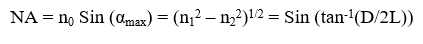

An Optical fiber consists of a cylindrical core of refractive index n1 and an outer cladding of refractive index n2 such that n1 > n2 .  The propagation of a signal is based on the phenomenon of Total Internal reflection as shown in the figure below: 
 
The numerical aperture relates the acceptance angle and refractive indices of the three media involved (the core, cladding and air) and is a basic descriptive characteristic of an optical fiber. Numerical aperture represents the size or degree of openness of the input acceptance cone. Mathematically it is defined as the sine half angle of the acceptance cone and is a very useful measure of light-collecting ability of a fiber. It can be represented as follows:  
 
where, 
αmax = the half acceptance angle, 	
n0  = the refractive index of air  
n1  = the refractive index of the core 
n2  = the refractive index of the cladding  
D     = the diameter of the spot on the screen  
L     = the distance between the output end of the fiber and the screen.  
If the incident angle α < αmax, the ray undergoes multiple internal reflections at core and cladding interface and it is called the guided ray. If α < αmax, the ray undergoes only partial reflection at core cladding interface. In short length of straight fiber, ideally a ray launched at angle α at the input end should come out at the same angle α from output end. Therefore, the far field at the output end will also
appear as a cone of semi angle αmax emanating from the fiber end. If the incident angle α >αmax then the signal can enter but cannot propagate through the fiber, it will get distorted.

